# 第五章 系统功能模块详述

本章将深入阐述数字化研发平台的核心业务模块。系统基于"高内聚、低耦合、服务化"的设计原则，构建了13大核心业务域。我们从功能架构、核心流程、数据定义、业务价值四个维度进行详细说明。

## 5.1 系统首页 (Dashboard)

### 5.1.1 模块概述
系统首页是研发人员的"数字驾驶舱"。它打破了传统系统的信息茧房，通过智能聚合算法，将跨模块的任务、消息、指标进行集中展示。

### 5.1.2 核心功能详单

| 功能大类 | 功能子项 | 功能描述 | 业务规则/逻辑 |
| :--- | :--- | :--- | :--- |
| **工作台配置** | 布局自定义 | 支持拖拽式调整卡片位置、大小。 | 配置仅对当前用户生效，管理员可设置默认模板。 |
| **待办中心** | 待办聚合 | 实时拉取OA审批、LIMS检测、配方评审等跨系统任务。 | 按SLA紧急程度自动红黄绿灯排序。 |
| **消息通知** | 多渠道推送 | 支持站内信、邮件、短信、App推送。 | 夜间（22:00-07:00）自动开启免打扰模式（紧急报警除外）。 |
| **全局搜索** | 智能检索 | 支持全文检索配方、文档、人员、功能菜单。 | 支持拼音首字母、同义词检索（如搜"薄荷"关联"清凉"）。 |
| **KPI看板** | 指标可视化 | 展示个人及团队的关键绩效指标。 | 数据T+1更新或实时更新（可配置）。 |

### 5.1.3 核心数据定义
*   **KPI指标库**：包含指标ID、名称、计算公式、数据来源、更新频率。
*   **用户偏好配置**：JSON格式存储的用户布局、主题、快捷入口配置。

### 5.1.4 典型页面

---

## 5.2 市场洞察模块 (Market Insight)

### 5.2.1 模块概述
利用大数据和AI技术，全方位采集市场情报，为新品开发提供方向指引。

### 5.2.2 核心功能详单

| 功能大类 | 功能子项 | 功能描述 | 业务规则/逻辑 |
| :--- | :--- | :--- | :--- |
| **舆情监测** | 网络爬虫 | 自动抓取微博、小红书、烟草论坛的评价数据。 | 敏感词过滤机制；自动识别情感倾向（正/负/中）。 |
| | 热词分析 | 生成周/月度的高频词云。 | 去除无意义的虚词（如"的"、"了"）。 |
| **问卷调查** | 问卷设计 | 可视化拖拽设计问卷，支持逻辑跳转。 | 支持题库复用；支持设置每个IP仅限填写一次。 |
| | 投放管理 | 生成二维码链接，支持定向推送到会员库。 | 自动统计回收率，异常答题（时间过短）自动剔除。 |
| **竞品实验室** | 竞品档案 | 建立竞品全维数据库（价格/包装/理化/感官）。 | 支持上传竞品实物照片和评吸报告。 |
| | 对标分析 | 自动生成本品vs竞品的雷达对比图。 | 差异度超过10%的指标高亮显示。 |

### 5.2.3 核心数据定义
*   **舆情数据表**：来源平台、发布时间、内容文本、情感分值、关键词。
*   **问卷实例表**：问卷ID、题目结构（JSON）、开始时间、结束时间。
*   **答卷记录表**：用户ID、答案内容、答题耗时、IP地址。

### 5.2.4 典型页面
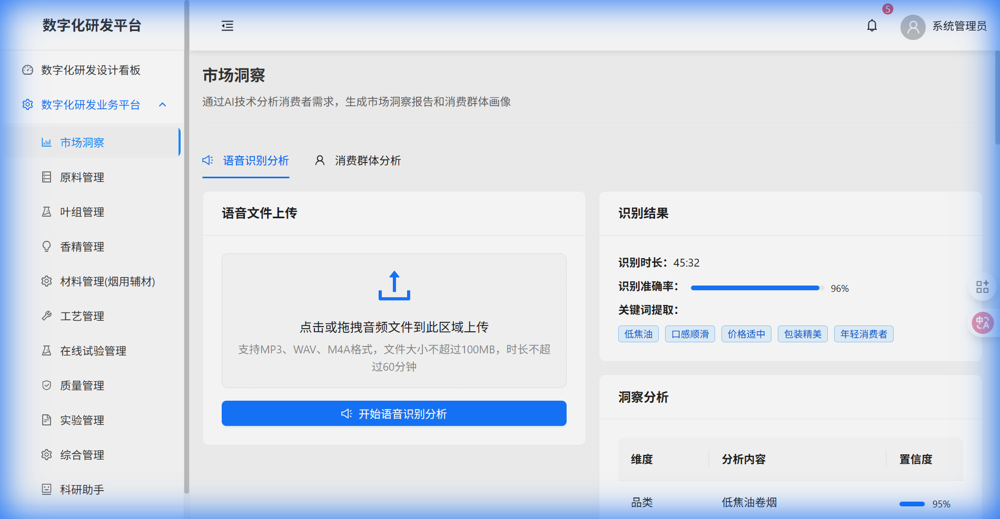
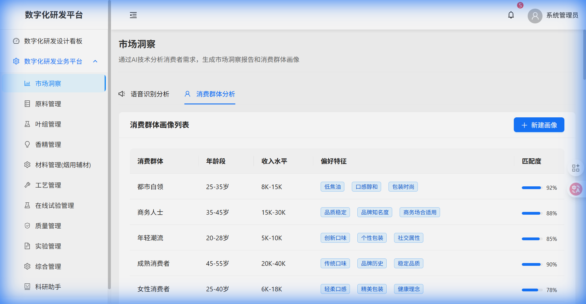

---

## 5.3 原料管理模块 (Material Management)

### 5.3.1 模块概述
实现从"田间"到"车间"的原料全生命周期精细化管理，核心是建立原料的数字化基因库。

### 5.3.2 核心功能详单

| 功能大类 | 功能子项 | 功能描述 | 业务规则/逻辑 |
| :--- | :--- | :--- | :--- |
| **基地管理** | 地块档案 | 记录基地GIS坐标、土壤pH值、气候数据。 | 必须关联供应商信息。 |
| **原料档案** | 基础信息 | 产地、等级、年份、供应商、采购批次。 | 批次号需符合公司编码规范（唯一性校验）。 |
| | 质量画像 | 关联外观、化学（糖/碱/氮）、感官评吸数据。 | 数据自动从LIMS同步，不可人工修改。 |
| **库存管理** | 库存查询 | 多维度（产地/等级）查询库存量、库存金额。 | |
| | 预警管理 | 呆滞库存预警、有效期预警、缺货预警。 | 预警阈值可配置（如：超过3年未领用标记为呆滞）。 |
| **采购辅助** | 需求测算 | 根据生产计划自动计算原料需求缺口。 | 需考虑安全库存和在途库存。 |

### 5.3.3 核心数据定义
*   **原料主数据**：原料编码（主键）、名称、类别（烟叶/香料/辅材）、计量单位。
*   **批次追踪表**：批次号、原料编码、供应商批号、入库日期、当前状态（正常/冻结）。
*   **库存流水表**：事务类型（入库/出库/盘点）、变动数量、关联单据号。

### 5.3.4 典型页面
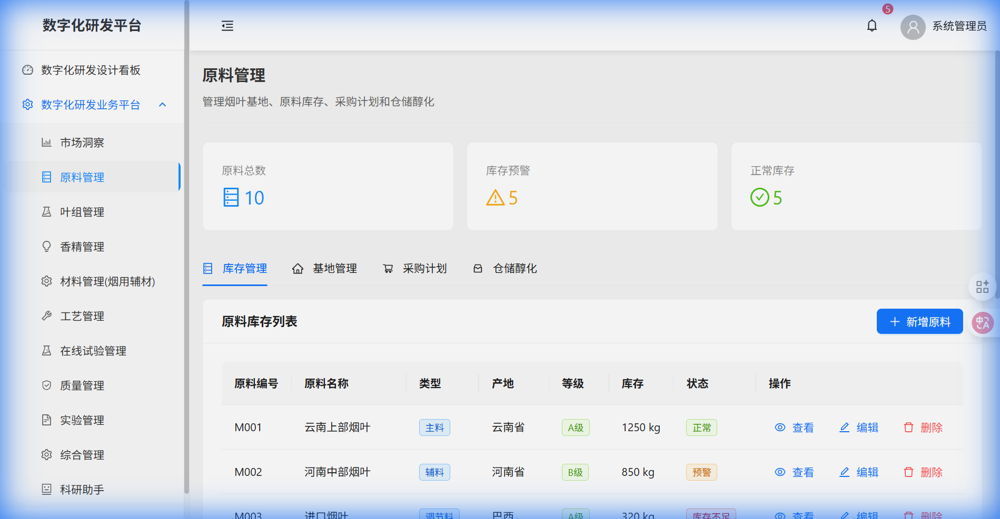
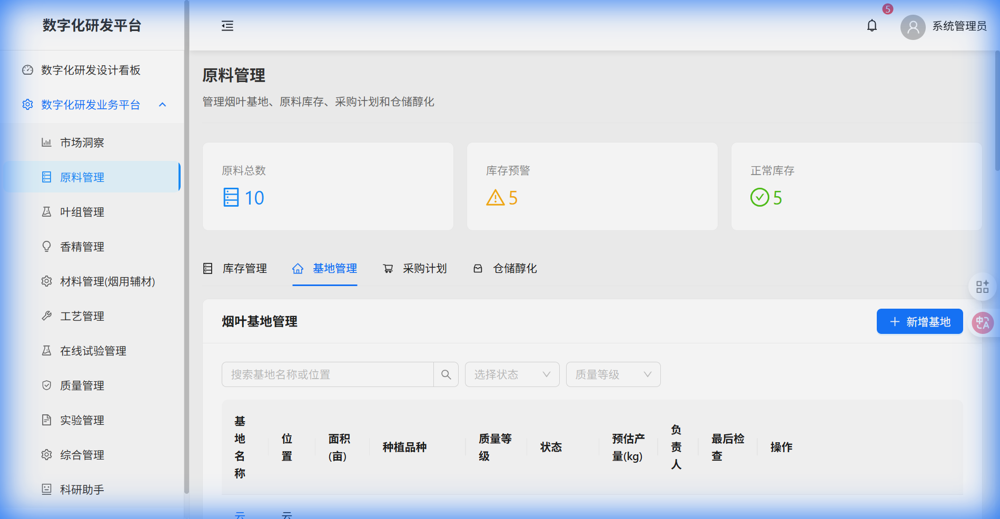
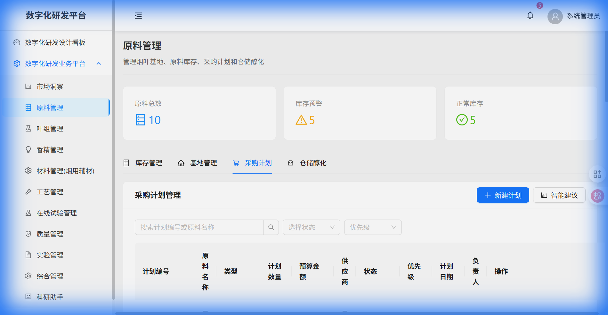

---

## 5.4 烟叶配方管理模块 (Formula Management)

### 5.4.1 模块概述
系统的核心模块。管理配方全生命周期，支持智能辅助设计。

### 5.4.2 核心功能详单

| 功能大类 | 功能子项 | 功能描述 | 业务规则/逻辑 |
| :--- | :--- | :--- | :--- |
| **配方维护** | 新建配方 | 支持从头新建、复制已有配方、引入模板。 | 必须指定适用牌号和设计版本号。 |
| | 结构编辑 | 添加/删除原料，调整比例。 | **总比例校验**：所有单料比例之和必须严格等于100%。 |
| | 成本计算 | 实时计算配方单箱成本。 | 成本 = ∑(原料库存单价 × 单耗)。 |
| **智能设计** | 替代推荐 | 原料缺货时，推荐理化指标最接近的替代料。 | 相似度算法基于欧氏距离计算。 |
| | 自动寻优 | 设定目标（成本/焦油），算法生成最优组合。 | 调用遗传算法引擎。 |
| **版本管理** | 版本树 | 可视化展示版本演进历史。 | |
| | 版本比对 | 双栏展示两个版本的差异（新增/删除/比例变化）。 | 差异项高亮显示。 |
| **配方评审** | 流程审批 | 发起配方变更评审流程。 | 必须包含“三级审批”（设计-审核-批准）。 |

### 5.3.3 核心数据定义
*   **配方头表**：配方ID、配方名称、适用牌号、版本号、状态（草稿/使用中/废止）、设计人。
*   **配方明细表**：配方ID、原料编码、使用比例（%）、投料顺序。
*   **配方版本链表**：当前ID、父版本ID、变更原因、变更时间。

### 5.4.4 典型页面

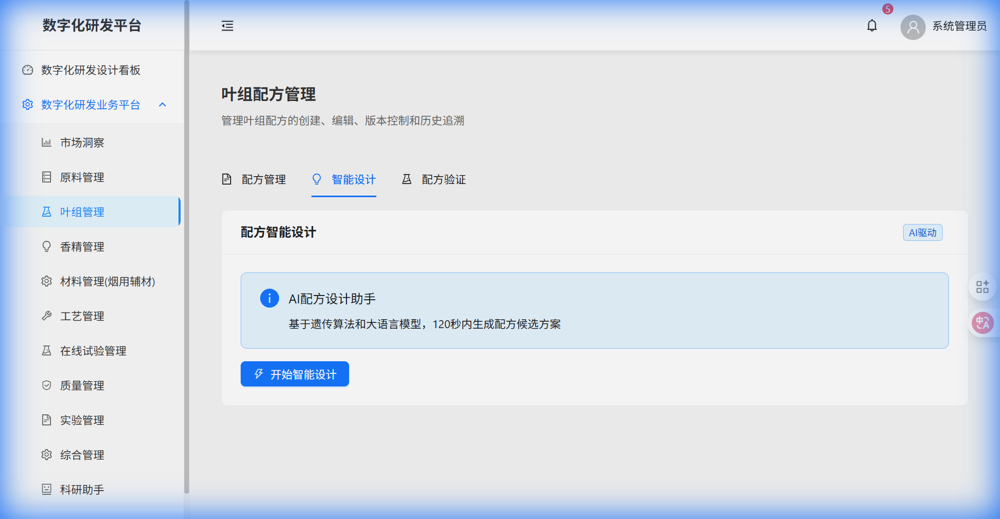
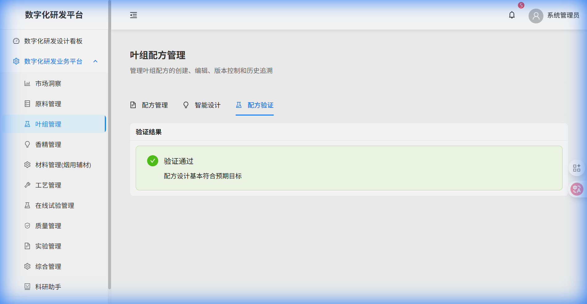

---

## 5.5 香精香料管理模块 (Flavor Management)

### 5.5.1 模块概述
管理香精香料的研发与调配，采用最高级别的安全加密措施。

### 5.5.2 核心功能详单

| 功能大类 | 功能子项 | 功能描述 | 业务规则/逻辑 |
| :--- | :--- | :--- | :--- |
| **香料库管理** | 单体档案 | 记录单体香料的CAS号、FEMA号、香韵特征。 | 香韵需遵循标准词汇表（如：它花香-茉莉香）。 |
| | 香基管理 | 管理复合香基的配方及属性。 | 香基可作为原料被下游香精配方引用。 |
| **智能调香** | 辅助选香 | 根据输入的感官描述（如"清甜"），AI推荐单体。 | 关联图谱数据库推荐相似单体。 |
| | 仿香工具 | 输入竞品理化数据，反推可能的配方构成。 | 相似度排序Top 3。 |
| **配方管理** | 电子调配单 | 在线生成调配工单，指导实验员称量。 | **防差错**：电子天平联网，称量误差超0.1g自动锁定。 |
| | 加密存储 | 核心配方数据加密入库。 | 仅系统管理员及本人可见，查看需二次认证。 |

### 5.5.3 核心数据定义
*   **香料主档**：编码、名称、类别（天然/合成）、安全阈值。
*   **评吸记录表**：样品ID、评吸员ID、香气质（1-9分）、香气量（1-9分）、评语。

### 5.5.4 典型页面
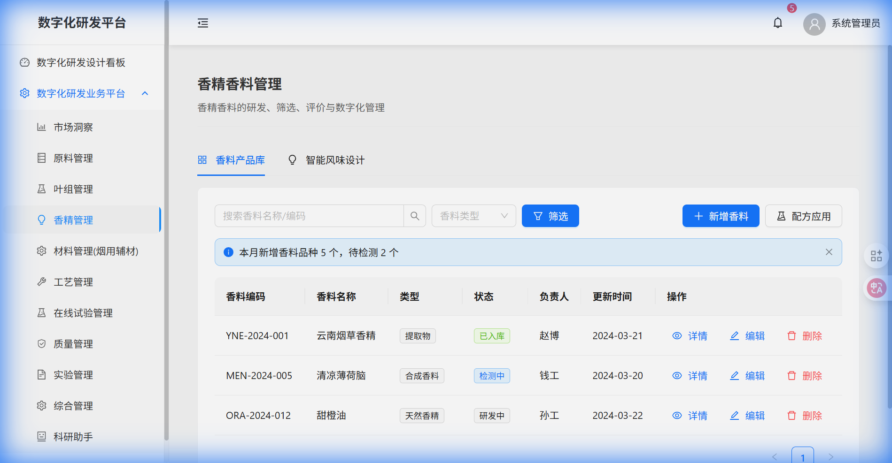
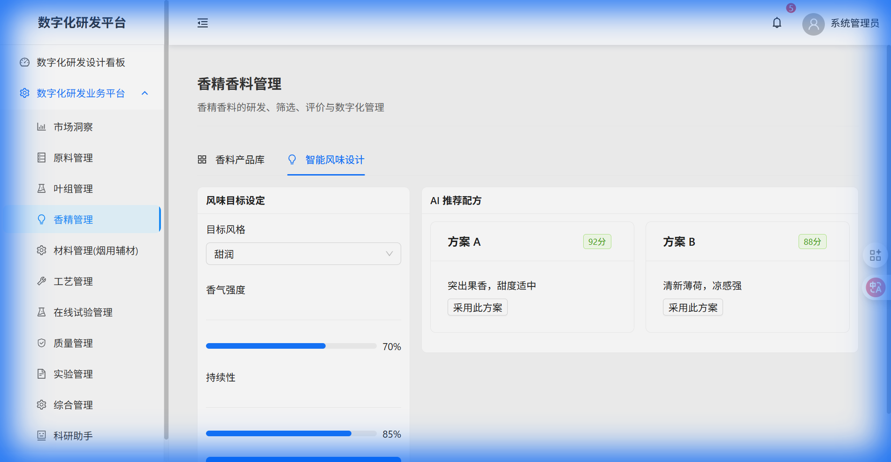

---

## 5.6 烟用材料管理模块 (Auxiliary Material)

### 5.6.1 模块概述
管理卷烟纸、接装纸、滤棒等辅材的选型与设计协同。

### 5.6.2 核心功能详单

| 功能大类 | 功能子项 | 功能描述 | 业务规则/逻辑 |
| :--- | :--- | :--- | :--- |
| **辅材参数库** | 参数定义 | 定义各类辅材的标准参数模板。 | 如卷烟纸：透气度、定量、罗纹类型。 |
| | 供应商协同 | 供应商在线上传材质证明文件。 | 资质过期自动冻结该供应商。 |
| **匹配设计** | 智能匹配 | 根据叶组特性推荐最佳辅材组合。 | 降焦预测模型：根据透气度预测焦油降低量。 |
| **包装设计** | 3D预览 | 2D平面图转3D烟包模型。 | 支持各角度旋转、缩放。 |
| | 在线审稿 | 对设计稿进行圈点批注。 | 保留所有修改历史版本。 |

### 5.6.3 核心数据定义
*   **辅材BOM表**：产品编码、材料编码、单耗、损耗率。
*   **设计稿版本表**：项目ID、版本号、文件路径、审核状态。

### 5.6.4 典型页面
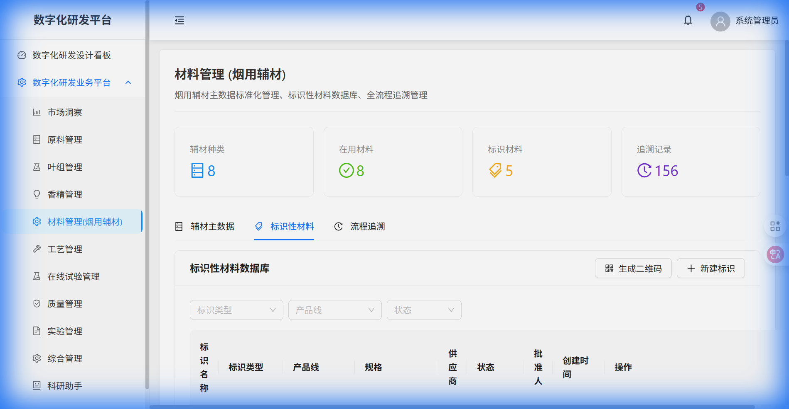

---

## 5.7 工艺管理模块 (Process Management)

### 5.7.1 模块概述
实现工艺标准的结构化设计与参数的自动化下发。

### 5.7.2 核心功能详单

| 功能大类 | 功能子项 | 功能描述 | 业务规则/逻辑 |
| :--- | :--- | :--- | :--- |
| **标准设计** | 结构化建模 | 树状结构定义制丝、卷接包各工序参数。 | 参数必须在设备能力范围内（如温度<140℃）。 |
| | 版本发布 | 审批通过后生成受控版本。 | 旧版本自动失效，且归档保留。 |
| **参数下发** | MES接口 | 将工艺参数写入生产机台。 | 下发前需校验机台状态（联网/运行）。 |
| **工艺仿真** | 参数模拟 | 预测参数调整对物理指标的影响。 | 基于历史生产大数据训练的模型。 |

### 5.7.3 核心数据定义
*   **工艺标准头表**：标准号、适用牌号、生效日期、版本。
*   **工序参数表**：标准号、工序ID（如烘丝）、参数名（温度）、标准值、公差上下限。

### 5.7.4 典型页面
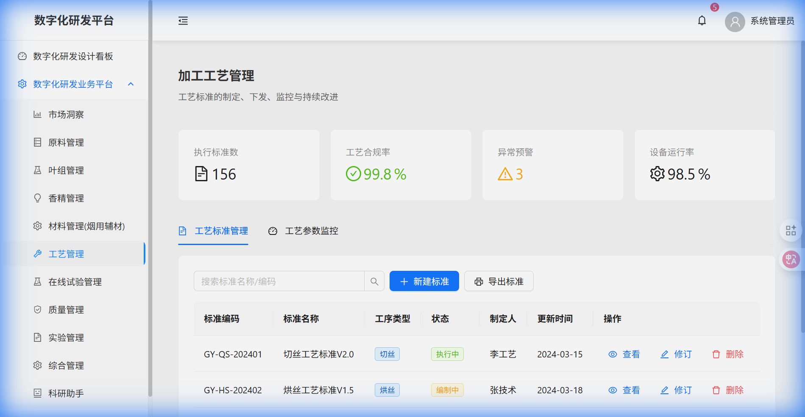
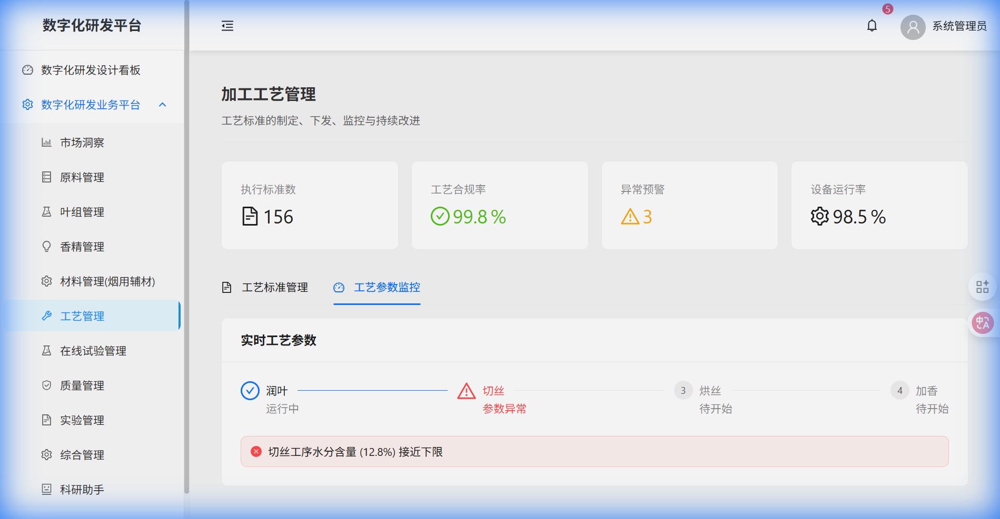

---

## 5.8 实验室管理模块 (LIMS)

### 5.8.1 模块概述
检测全流程数字化，确保合规（CNAS/ISO17025）。

### 5.8.2 核心功能详单

| 功能大类 | 功能子项 | 功能描述 | 业务规则/逻辑 |
| :--- | :--- | :--- | :--- |
| **委托管理** | 在线委托 | 填写检测申请，生成条码。 | 自动计算预计检测费用和周期。 |
| **样品管理** | 留样/处置 | 管理检后样品的留存位置与销毁。 | 留样期满自动提醒清理。 |
| **检测执行** | 任务分配 | 按人员资质分配检测任务。 | 无此项目上岗证的人员不可被分配。 |
| | 数据采集 | 仪器数据自动上传。 | 原始数据文件自动归档备份。 |
| **报告管理** | 自动生成 | 汇总数据生成PDF报告。 | 自动加盖电子签章和防伪水印。 |

### 5.8.3 核心数据定义
*   **检测委托单**：委托单号、送样人、检测项目列表、要求完成时间。
*   **检测结果表**：样品ID、检测项目、测定值、单位、依据标准。

### 5.8.4 典型页面
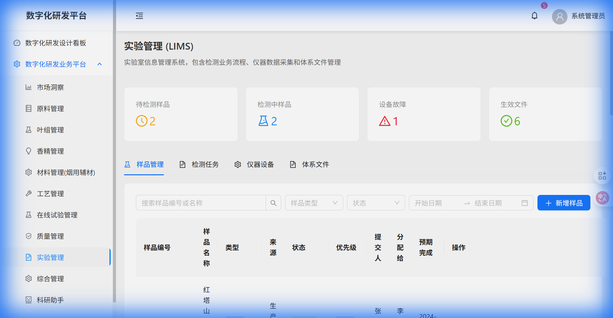
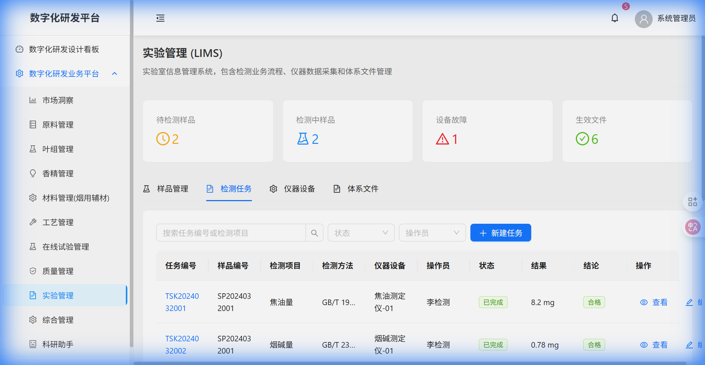
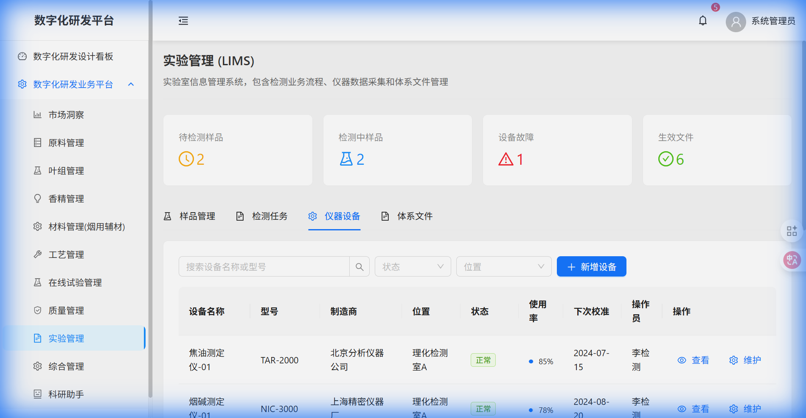

---

## 5.9 质量管理模块 (Quality Management)

### 5.9.1 模块概述
全生命周期质量数据中心，摒弃纸质记录。

### 5.9.2 核心功能详单

| 功能大类 | 功能子项 | 功能描述 | 业务规则/逻辑 |
| :--- | :--- | :--- | :--- |
| **检验任务** | 任务中心 | 统一管理IQC、IPQC、OQC任务。 | 生产领料出库自动触发IQC任务。 |
| **现场质检** | 移动录入 | 质检员使用Pad录入巡检数据。 | 支持拍照上传外观缺陷。 |
| | 自动判定 | 根据内控标准自动判定合格/不合格。 | 严重不合格（A类缺陷）自动触发停机报警。 |
| **质量分析** | SPC分析 | X-bar控制图、CPK过程能力指数分析。 | 连续3点上升/下降触发趋势报警。 |
| | 追溯查询 | 输入批次号，反查所有检验记录。 | 双向追溯（成品->原料，原料->成品）。 |

### 5.9.3 核心数据定义
*   **检验标准库**：物料编码、检验项目、合格标准、抽样方案（GB/T 2828）。
*   **不合格品处置单**：来源单号、不合格数量、处置方式（报废/返工/让步）。

### 5.9.4 典型页面
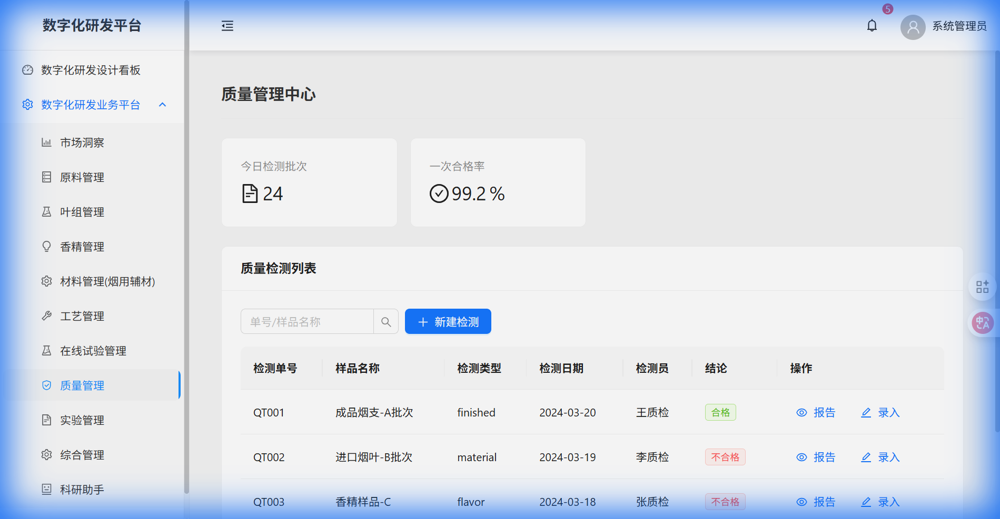

---

## 5.10 在线试验模块 (Online Experiment)

### 5.10.1 模块概述
解决中试资源排程与过程数据监控。

### 5.10.2 核心功能详单

| 功能大类 | 功能子项 | 功能描述 | 业务规则/逻辑 |
| :--- | :--- | :--- | :--- |
| **试验排程** | 甘特图 | 可视化编排试验计划。 | 自动检测同一时间段机台冲突。 |
| **过程监控** | 实时采集 | 频率1Hz采集机台参数（温度/速度/水分）。 | |
| | 异常标记 | 自动标记参数波动异常的时间区间。 | 波动超过±3σ。 |
| **试验报告** | 一键生成 | 自动汇总工艺参数与检测数据。 | |

### 5.10.3 核心数据定义
*   **试验任务单**：任务名称、负责人、计划开始时间、占用机台。
*   **时序数据库**：TagID（测点）、时间戳、数值。

### 5.10.4 典型页面
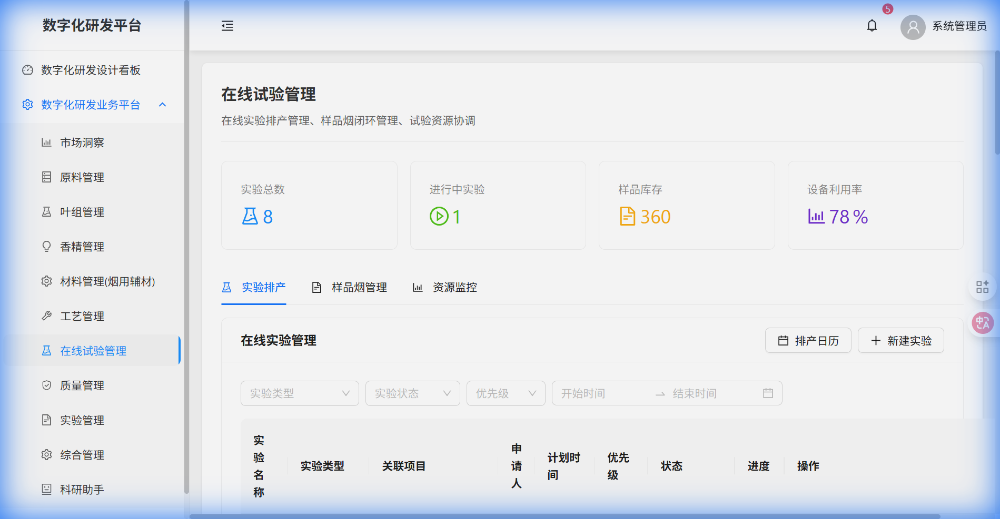
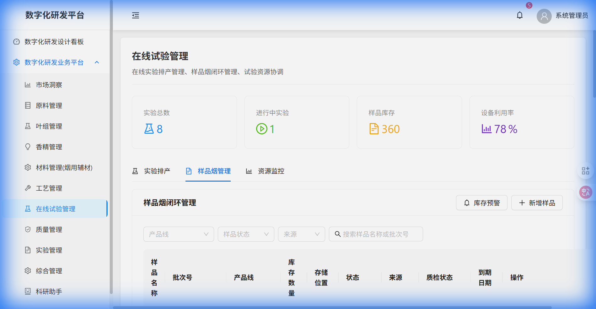
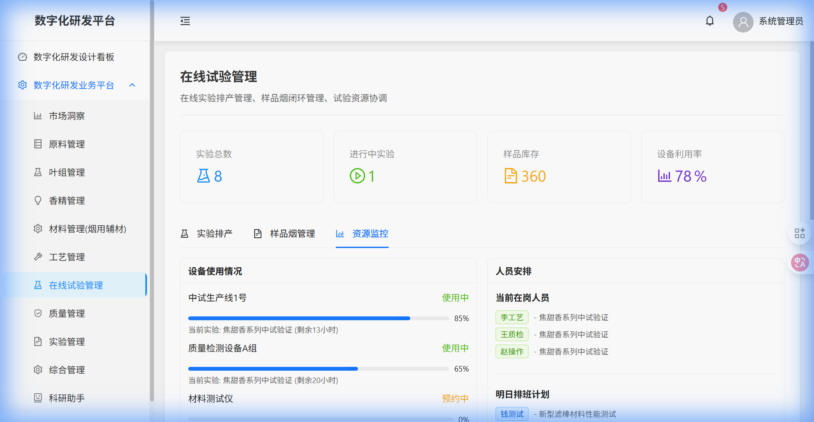

---

## 5.11 综合管理模块 (Comprehensive Management)

### 5.11.1 模块概述
研发资源的后勤总管。

### 5.11.2 核心功能详单

| 功能大类 | 功能子项 | 功能描述 | 业务规则/逻辑 |
| :--- | :--- | :--- | :--- |
| **项目管理** | 里程碑 | 定义项目关键节点（WBS）。 | 关键路径节点延期自动升级预警。 |
| | 经费管理 | 预算编制与执行监控。 | 预算超支需走特批流程。 |
| **资产管理** | 设备台账 | 一机一码，扫码盘点。 | |
| | 维保计划 | 自动生成周期性维护计划。 | |

### 5.11.3 核心数据定义
*   **科研项目表**：项目ID、名称、类别（A/B/C类）、总预算。
*   **经费执行表**：项目ID、科目（材料费/差旅费）、报销金额。

### 5.11.4 典型页面
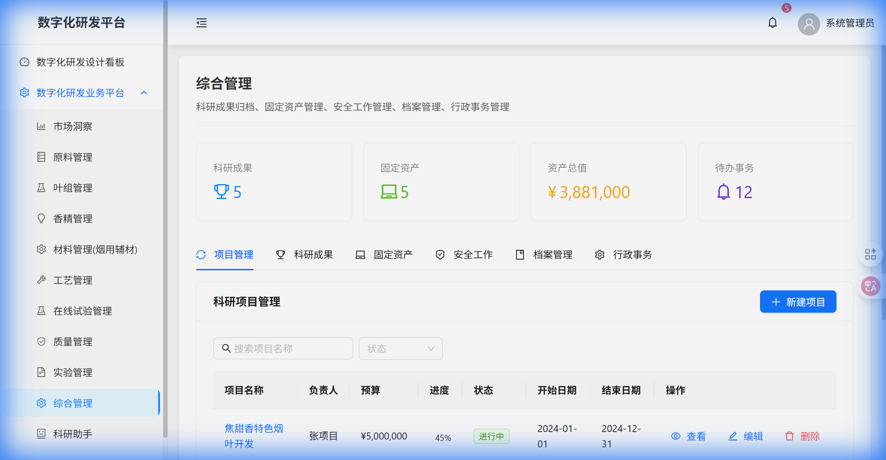
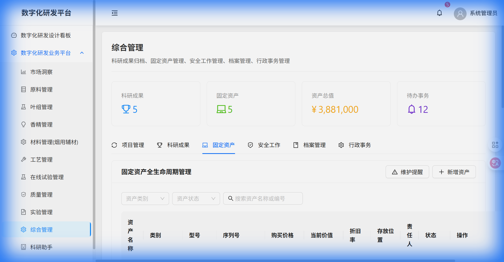

---

## 5.12 科研助手模块 (Research Assistant)

### 5.12.1 模块概述
AI赋能的科研知识服务平台。

### 5.12.2 核心功能详单

| 功能大类 | 功能子项 | 功能描述 | 业务规则/逻辑 |
| :--- | :--- | :--- | :--- |
| **知识检索** | 语义搜索 | 搜索"降焦技术"，返回相关文献及段落。 | 基于向量数据库（Vector DB）。 |
| **辅助创作** | 智能摘要 | 自动生成长文档摘要。 | |
| | 翻译助手 | 中英互译专业文献。 | 保留原文排版格式。 |

### 5.12.3 核心数据定义
*   **知识库索引**：文档ID、Vector Embedding向量、全文索引。

### 5.12.4 典型页面
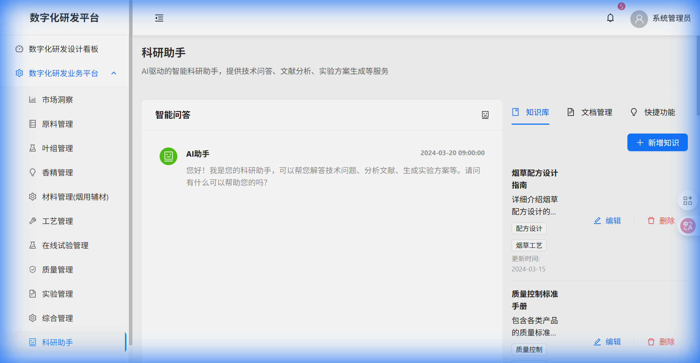
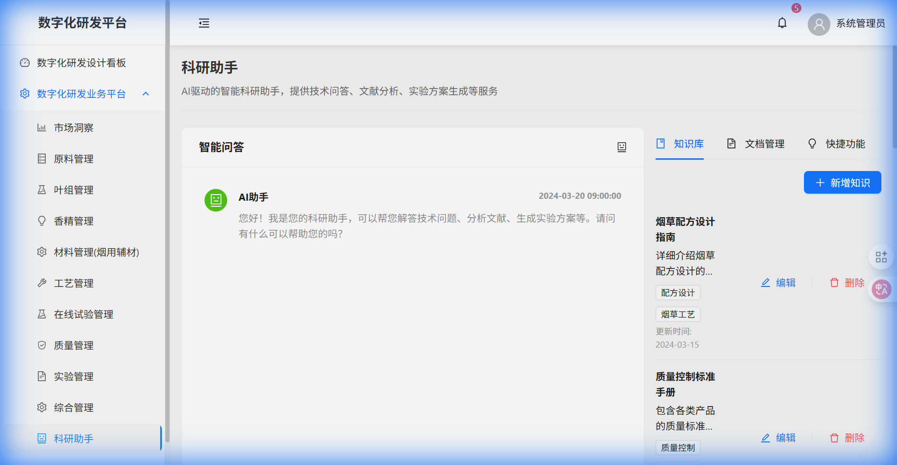

---

